# PlateAI 🍽️

A food delivery app built with **React Native + Expo**. PlateAI demonstrates every major navigation pattern — stack, tab, drawer, nested navigators, deep linking, auth flow, and animated transitions — wrapped in a clean, production-inspired UI.

---

## Demo Credentials

```
Email     demo@plateai.com
Password  123456
```

---

## Screenshots

| Splash | Onboarding | Login |
|--------|------------|-------|
| 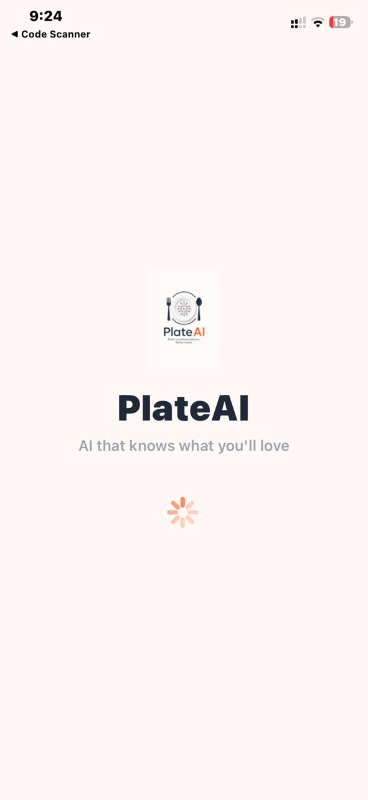 | 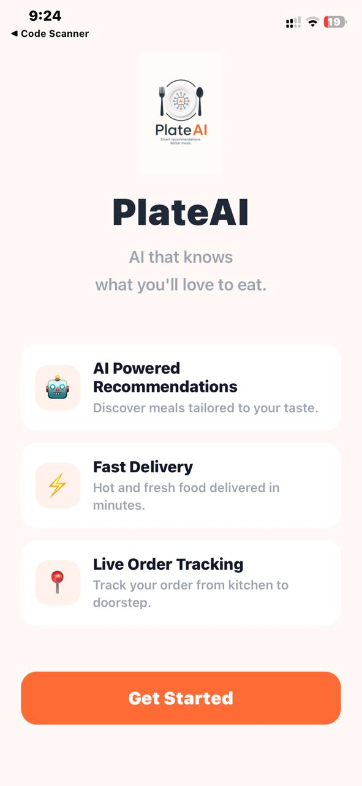 | 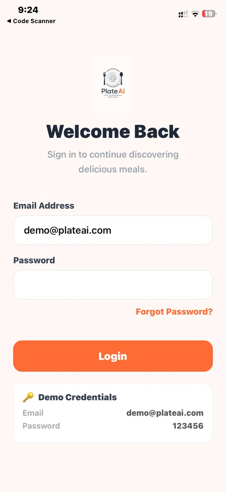|

| Home | Details | Cart |
|------|---------|------|
| 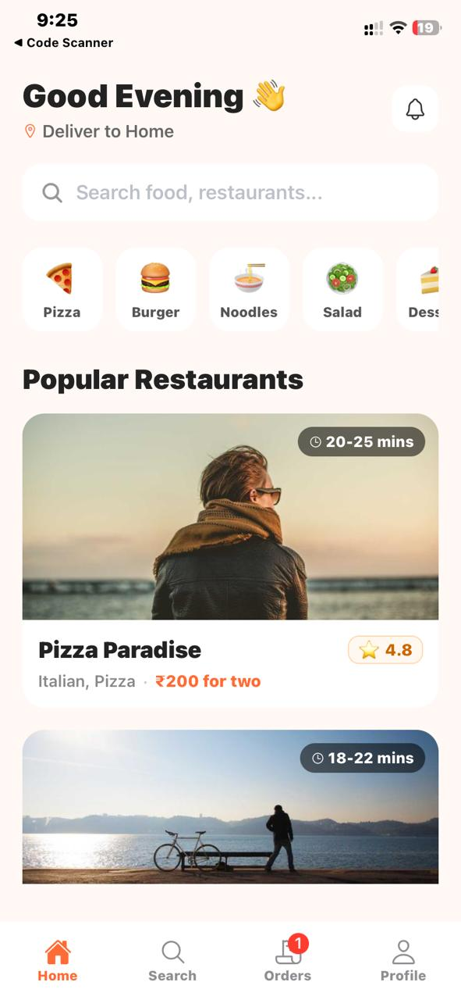 | 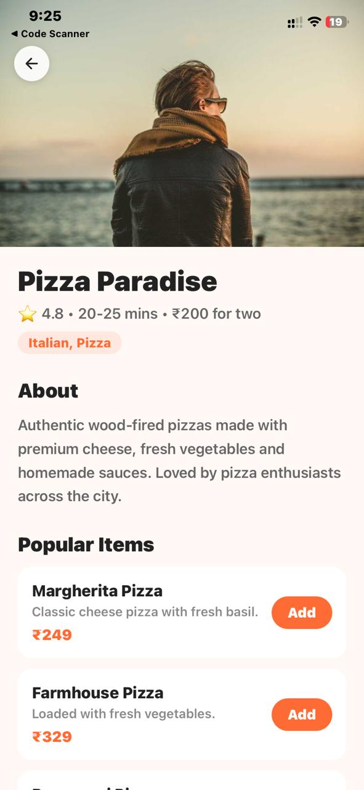 | 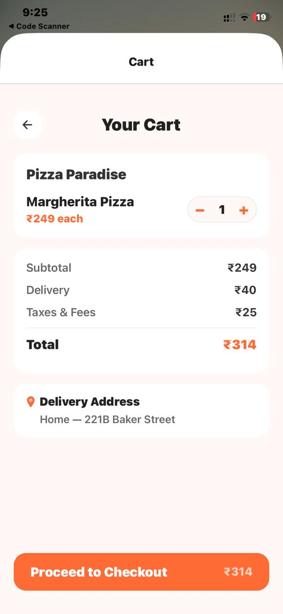 |

| Search | Orders | Profile |
|--------|--------|---------|
| 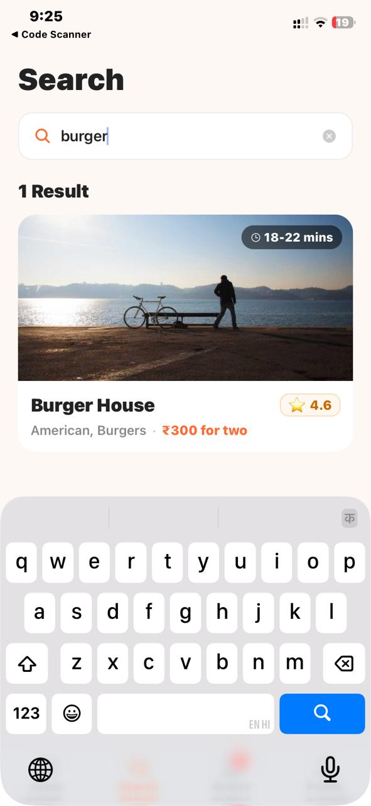 | 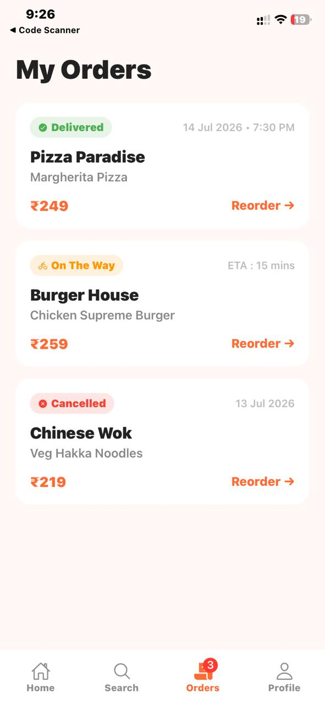 | 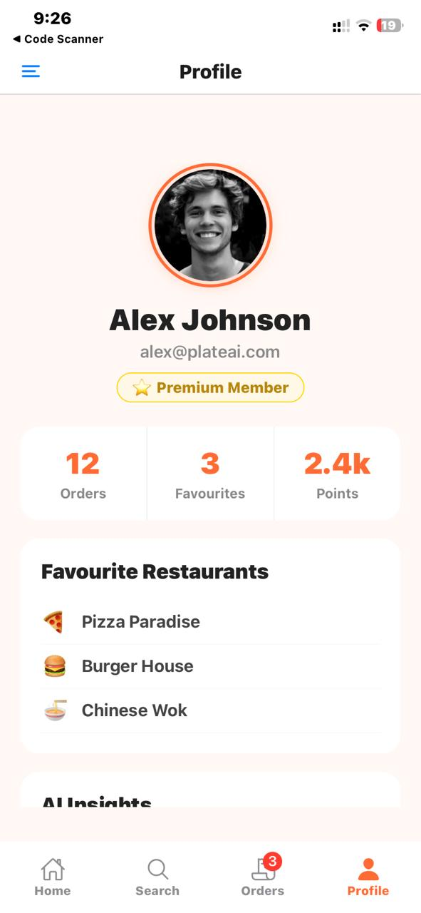 |

| Settings | Help | Logout |
|--------|--------|---------|
| 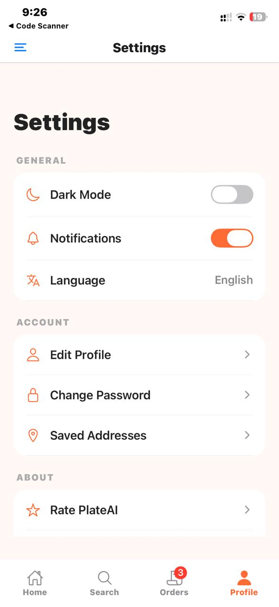 | 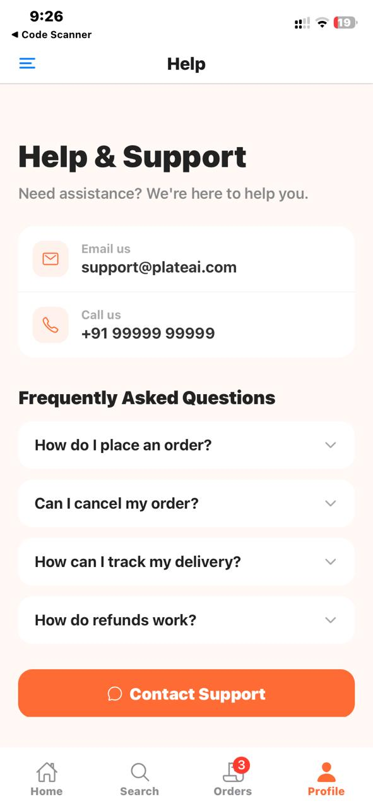 | 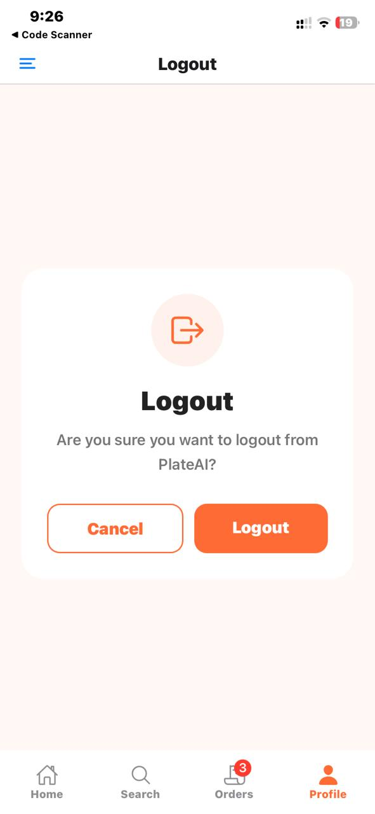 |

---

## Features

### Auth Flow
- Splash screen with logo and loading indicator
- Onboarding screen (shown only once)
- Mock login — no backend as of now
- Auth state + boarding state persisted with **AsyncStorage**
- Automatic redirect based on stored auth state on app launch

### Home
- Time-aware greeting (Good Morning / Afternoon / Evening)
- Location display with pin icon
- Horizontal category chips with emoji labels (Pizza, Burger, Noodles…)
- Restaurant cards with delivery time chip overlaid on image
- Tapping the search bar navigates directly to the Search tab

### Search
- Live filter by restaurant name or cuisine
- Tappable popular search chips (auto-fill input)
- Clear button inside input
- Live result count
- Empty state when no results match

### Restaurant Details
- Full hero image with floating back button
- Cuisine displayed as an orange chip
- Menu items in cards — each with a compact "Add" pill button
- Adding an item increments the cart badge on the Orders tab

### Cart
- Working quantity stepper (`−` / `+`) that updates the total live
- Price breakdown: Subtotal, Delivery (₹40), Taxes (₹25), Total
- Delivery address display
- "Proceed to Checkout" button shows total price inline

### Orders
- Order history cards with soft-coloured status badges + icon
- Statuses: `Delivered` (green), `On The Way` (orange), `Cancelled` (red)
- Empty state for when no orders exist

### Profile (Drawer)
- Avatar with orange ring border
- Premium Member badge
- Horizontal stats row: Orders · Favourites · Points
- Favourite restaurants list
- AI Insights section
- Accessible from the Profile tab via a side drawer

### Settings
- Dark Mode toggle, Notifications toggle, Language selector
- Edit Profile, Change Password, Saved Addresses
- Rate app, Privacy Policy, Version
- Switches use brand orange track colour

### Help & Support
- Contact card with Email and Call rows
- **Accordion FAQ** — tap any question to expand/collapse the answer with animation
- Contact Support button

### Logout
- Confirmation card with Cancel (goes back) and Logout buttons
- Logout clears AsyncStorage and resets app state

---

## Navigation Architecture

```
App.tsx
│
├── SplashScreen (shown while checking AsyncStorage)
│
└── NavigationContainer
      │
      └── RootStack (NativeStack)
            │
            ├── [unauthenticated] AuthStack (NativeStack)
            │     ├── OnBoarding
            │     └── Login
            │
            └── [authenticated]
                  ├── HomeTabs (BottomTabs)
                  │     ├── Home
                  │     ├── Search
                  │     ├── Orders
                  │     └── Profile
                  │           └── ProfileDrawer
                  │                 ├── Profile
                  │                 ├── Settings
                  │                 ├── Help
                  │                 └── Logout
                  │
                  ├── Details (Stack — slide from right)
                  └── Cart    (Stack — modal slide from bottom)
```

---

## Navigation Patterns Used

| Pattern | Where |
|---|---|
| Native Stack | Root, Auth flow, Details, Cart |
| Bottom Tabs | Main app (Home / Search / Orders / Profile) |
| Drawer | Profile section |
| Nested Navigators | Drawer inside Tab inside Stack |
| `navigate()` | Home → Details, Details → Cart, Cart → Orders |
| `replace()` | OnBoarding → Login (no back) |
| `goBack()` | Back buttons on Details, Cart, Logout cancel |
| Params passing | Full `restaurant` object passed Home → Details → Cart |
| Tab badge | Cart count badge on Orders tab |
| Header control | Custom floating back button, hidden default headers |
| Transition animations | `slide_from_right` (default), `slide_from_bottom` (Cart modal) |
| Deep linking | `plateai://restaurant/:id` |
| AsyncStorage | `isAuthenticated`, `hasSeenBoarding` |

---

## Design Decisions

**Passing the full object, not individual fields**

```tsx
// ✅ What PlateAI does
navigation.navigate("Details", { restaurant });

// ❌ What it avoids
navigation.navigate("Details", { name, rating, image, deliveryTime, ... });
```

Passing the entire `Restaurant` object keeps navigation calls clean, avoids prop drilling individual fields, and makes adding new data to a screen as simple as reading a new property.

**Auth state lives at the root**

`isAuthenticated` and `hasSeenBoarding` are managed in `App.tsx` and flow down through the navigator tree. Changing either flag instantly re-renders the correct navigator branch — no manual navigation calls needed.

**Cart as a modal stack screen**

Cart slides up from the bottom (`slide_from_bottom` + `modal` presentation) instead of a horizontal push. This clearly signals to the user that they haven't left the restaurant context — they can swipe down to go back.

---

## Folder Structure

```
src/
├── components/
│   ├── CategoryChip.tsx      # Emoji chip with label
│   ├── CustomDrawerContent.tsx
│   ├── FAQItem.tsx           # Accordion with LayoutAnimation
│   ├── OrderCard.tsx         # Order history card
│   ├── RestaurantCard.tsx    # Card with image + delivery chip
│   ├── SearchBar.tsx
│   └── SettingRow.tsx
│
├── data/
│   ├── Categories.ts         # Emoji array for category chips
│   ├── Orders.ts             # Mock order history
│   └── Restaurants.ts        # Mock restaurant + menu data
│
├── navigators/
│   ├── AuthStackNavigator.tsx
│   ├── MainTabNavigator.tsx
│   ├── ProfileDrawerNavigator.tsx
│   └── RootStackNavigator.tsx
│
├── screens/
│   ├── SplashScreen.tsx
│   ├── OnBoardingScreen.tsx
│   ├── LoginScreen.tsx
│   ├── HomeScreen.tsx
│   ├── SearchScreen.tsx
│   ├── DetailsScreen.tsx
│   ├── CartScreen.tsx
│   ├── OrderScreen.tsx
│   ├── ProfileScreen.tsx
│   ├── SettingsScreen.tsx
│   ├── HelpScreen.tsx
│   └── LogoutScreen.tsx
│
└── storage/
    └── authStorage.ts        # AsyncStorage helpers
```

---

## Tech Stack

| Layer | Technology |
|---|---|
| Framework | React Native 0.81 + Expo SDK 54 |
| Language | TypeScript |
| Navigation | React Navigation 7 |
| Storage | AsyncStorage |
| Icons | @expo/vector-icons (Ionicons) |


**Navigation packages**

```
@react-navigation/native
@react-navigation/native-stack
@react-navigation/bottom-tabs
@react-navigation/drawer
```

---

## Running Locally

```bash
# 1. Clone
git clone https://github.com/saumyaJha7/plateAI.git
cd plateAI

# 2. Install
npm install

# 3. Start
npx expo start
```

Then press `a` for Android emulator, `i` for iOS simulator, or scan the QR code with **Expo Go**.

---

## Scope & Assumptions

This is an assignment project. The following are intentionally out of scope:

- No backend — auth is mocked, any email/password logs you in
- No real payment gateway
- No API calls — all restaurant and order data is static
- Cart holds a single selected item (no multi-item cart state)
- No push notifications

---

## Assignment Requirements Checklist

- ✅ Expo project setup
- ✅ Stack Navigator
- ✅ Bottom Tab Navigator
- ✅ Drawer Navigator
- ✅ Nested navigators (Stack → Tabs → Drawer)
- ✅ Params passing between screens
- ✅ Custom drawer content
- ✅ Tab bar badge (cart count)
- ✅ Authentication flow
- ✅ AsyncStorage persistence
- ✅ Programmatic navigation (`navigate`, `goBack`, `replace`)
- ✅ Transition animations
- ✅ Deep linking
- ✅ README

---

## Future Improvements

- Real auth with a backend (JWT / OAuth)
- Live AI recommendation engine based on order history
- Multi-item cart with Context API or Zustand
- Real-time order tracking with WebSockets
- Restaurant search via API with pagination
- Push notifications
- Dark mode support
- Profile editing
- Restaurant reviews and ratings
- Payment gateway integration